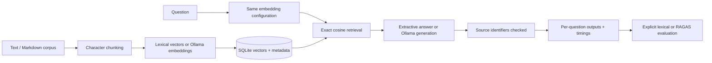

# Implemented local architecture

Status: local workflow covered by automated tests and
[live Ollama CPU checks](../../../evals/benchmarks/project-docs-v1/results/2026-09-23/README.md).
GPU training and OpenShift execution require separate integration verification.

`src/mobility_ai/capstone/app.py` implements this workflow. Ingestion saves source identifiers,
chunk text, vectors, corpus hash, and model/configuration metadata in one database transaction.
Repeating ingestion replaces the corpus instead of appending duplicate chunks. Failed
embedding calls leave the previous database intact. Retrieval rejects incompatible vectors.

The offline mode uses an explicit token vocabulary and count vectors. It demonstrates the
same persistence and retrieval path without claiming semantic understanding. Ollama mode
uses model embeddings and generated answers; failures are propagated. Citation validation
rejects nonexistent identifiers but does not establish factual correctness. Judge-based
RAGAS evaluation is an explicit, separately configured operation.

The KFP compiler wraps the same CLI in two container components and produces real database,
record, and report artifacts. Cluster execution is unverified. SQLite and linear vector
search are deliberately limited to a small local corpus and one writer.

## Proposed extensions

The ADRs and deployment templates describe exercises for pgvector/Qdrant, LangGraph,
Redis, GraphRAG, GPU inference, LoRA, access control, and observability. They are not
implemented together as an enterprise platform. Add one integration at a time and verify
its behavior against the local baseline. No throughput, latency SLO, quality gain, or
production readiness is claimed without a reproducible run artifact.
